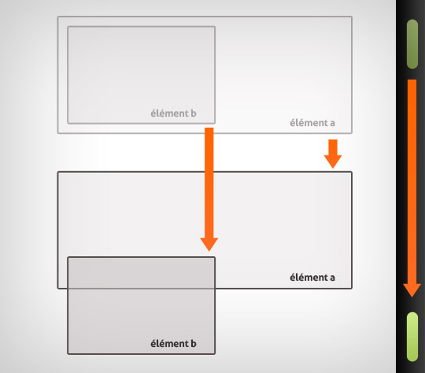

# js-tp-parallax

> A JS exercise use at HEPL for DCC.

* * *

**js-tp-parallax** is an educational project, which will be used for `JS` courses.

**Note:** the school where the course is given, the [HEPL](http://www.provincedeliege.be/hauteecole) from Liège, Belgium, is a French-speaking school. From this point, the instruction will be in French. Sorry.

* * *

## L'effet parallaxe

Un effet parallaxe c'est quand au moins 2 éléments sur 2 plans différents évoluent à des vitesses différentes.

Voici quelques exemples : 

- [digitalhands.net](http://www.digitalhands.net/)
- [bikingboss.com](http://www.bikingboss.com/)
- [nikebetterworld.com](http://www.nikebetterworld.com/product)
- [ok-studios.de](http://www.ok-studios.de/home/)
- [driver-club](http://driver-club.uk.ubi.com/xbox/trends)

Grâce à l'utilisation de JavaScript, il est possible de déplacer les éléments par rapport à la position de la souris ou du niveau de défilement (*scroll*). Le but va donc être de modifier les valeurs de positionnement en fonction de ces paramètres que l'on mesure.

Avec une **même distance de scroll**, l'élément `a` aura parcouru une distance **plus faible** que **l'élément `b`. C'est cette différence de vitesse qui crée l'effet parallaxe.

## Énoncé

Dans le cadre de cet exercice, nous vous demandons de produire un effet parallaxe.

Comparez attentivement la position du texte `Lorem Impsum` sur l'image de gauche et de droit. Dans la version sans JS (droite), le texte reste toujours à la même position (référez-vous au pavé du sol). En opposition à la version de gauche où le défilement du texte n'évolue pas à la même vitesse que l'image.

Nous vous demandons de reproduire cet effet à l'aide de JavaScript.

## Aides

1. Observez le défilement de la page. 

2. Lorsque l'image commence à disparaitre de la fenêtre, mais qu'elle est encore visible, modifiez la valeur de la propriété `backgroundPositionY` de l'objet style appartenant à la boite contenant l’image `.parallax`.

3. Votre but c'est que le `backgroundPositionY` évolue 2 fois plus lentement que le texte dont vous ne changez pas sa position.

## Sources 
[Parallax Scrolling with Vanilla Javascript- Single Element](https://codepen.io/manz/pen/QEyqyP) de Manz.  

[Zoom sur l'effet parallaxe](https://www.alsacreations.com/tuto/lire/1417-zoom-sur-effet-parallaxe.html) de [Simon-K](https://www.alsacreations.com/profil/lire/19193-Simon-K.html).   

